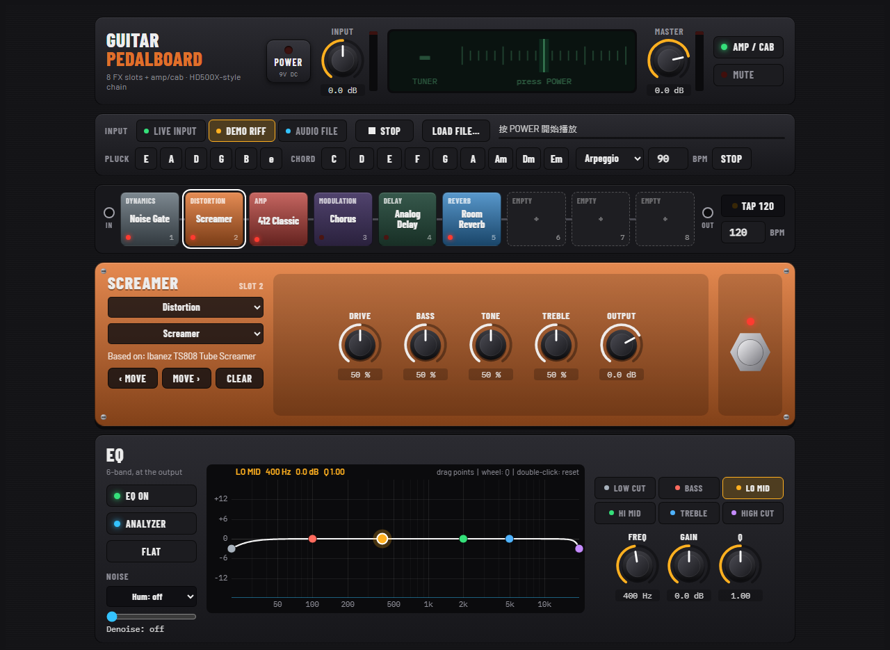
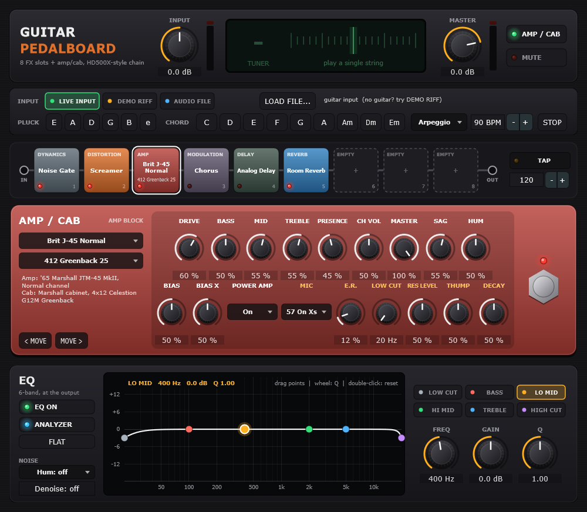

# Guitar Pedalboard：電吉他綜合效果器

在瀏覽器裡就能用的電吉他綜合效果器，介面和訊號鏈仿 Line 6 POD HD500X。電腦、手機都能用，不需要安裝。

### ▶ 立即使用：**https://anyouhuang.github.io/guitar-pedalboard/**

## 特色

- **HD500X 式訊號鏈**：8 個效果格 + 1 個 AMP / CAB 方塊，順序可以自由拖曳調整。
- **118 種效果**：Dynamics、Distortion、Modulation、Filter / Synth、Pitch、Preamp + EQ、Delay、Reverb、Wah、Volume / Pan。
- **AMP / CAB**：50 種音箱頭、22 種音箱、14 種麥克風；選音箱頭時會自動換成它通常搭配的音箱。
- **調音器**：常駐在畫面上方，點一下可以開 / 關。
- **6 段 EQ** 加即時頻譜，可以直接在圖上拖曳調整。
- **雜訊處理**：Hum 濾掉電源哼聲（50 / 60 Hz），Denoise 在不彈的時候壓低嘶聲。
- **TAP 拍速**：延遲時間可以跟著拍子走。
- **沒有吉他也能玩**：內建吉他樂句、載入自己的音檔、撥空弦、刷和弦。
- **設定會自動記住**：下次打開會回到上次的狀態。

## 快速開始

1. 打開 https://anyouhuang.github.io/guitar-pedalboard/ ，按畫面上方的 **POWER**。
2. **沒有吉他**：INPUT 選 **DEMO RIFF**，就會播放內建的吉他樂句，可以直接試各種效果。
3. **接吉他**：吉他接 USB 錄音介面，INPUT 選 **LIVE INPUT**，瀏覽器詢問時按「允許」使用麥克風。

> ⚠️ 接吉他時請戴耳機，不要用筆電內建麥克風加喇叭，否則會產生回授尖叫。

## 接吉他

- **需要錄音介面**（有 Hi-Z / Instrument 輸入的 USB 介面）。手機可以用 USB-C 錄音介面；iPhone 用 Lightning 或 USB-C 的介面。
- **瀏覽器**：新版的 Chrome、Edge、Safari、Firefox 都可以。
- **一定要用上面的 https 網址開**：瀏覽器只允許 HTTPS 網頁使用麥克風。
- **如果不小心按了「不允許」麥克風**：
  - iPhone Safari：網址列左邊「大小」→「網站設定」→「麥克風」→「允許」。
  - 電腦版 Chrome / Edge：網址列左邊的圖示 →「麥克風」→「允許」，然後重新整理頁面。
- **延遲**：瀏覽器的延遲一般約 10–40 ms，視裝置而定；頁面最下方的「音訊狀態」會顯示瀏覽器回報的延遲。
- **iPhone / iPad**：側邊的靜音開關會把網頁聲音關掉，請先打開。
- **斷音**：效果開得很多時，較舊的手機可能會斷音，請減少同時開啟的效果。

## 操作方式

| 操作 | 方法 |
|---|---|
| 編輯效果 | 點一下訊號鏈上的方塊，下方會出現它的旋鈕，可以換「效果類型」和「型號」 |
| 開 / 關效果 | 點兩下方塊，或按編輯區右邊的腳踏開關 |
| 換位置 | 用滑鼠拖曳方塊，或按 `‹ MOVE` / `MOVE ›`（手機用按鈕） |
| 放入效果 | 空的格子選一個「效果類型」；`CLEAR` 清空 |
| 旋鈕 | 上下拖曳調整，按住 Shift 微調；點兩下回到預設值；點一下後也可以用滑鼠滾輪或方向鍵 |
| EQ | 拖曳圖上的彩色圓點（左右 = 頻率、上下 = 增益），游標在圓點上時滾輪調 Q，點兩下圓點重設，`FLAT` 全部歸零 |
| TAP | 跟著拍子在 TAP 上點 3–4 下；延遲的 Note 選了音符值（例如 1/4、1/8.）後，延遲時間會跟著這個速度 |
| 調音器 | 點一下開 / 關 |
| NOISE（EQ 左下） | Hum 選 60 Hz（台灣、美洲）或 50 Hz（歐洲、中國）；Denoise 往右拉越強，30–50% 通常就夠 |

### 沒有吉他時的測試聲音

| 按鈕 | 作用 |
|---|---|
| **DEMO RIFF** | 循環播放內建的吉他樂句（約 11 秒） |
| **AUDIO FILE / LOAD FILE…** | 循環播放你載入的音檔（WAV、MP3、FLAC、OGG、M4A、AIFF），建議用沒有效果的吉他 DI 乾聲 |
| **STOP / PLAY** | 停止 / 從頭播放 |
| **PLUCK E A D G B e** | 撥一根標準音高的空弦，可以試調音器 |
| **CHORD** | C、D、E、F、G、A、Am、Dm、Em 九個基本和弦 |
| **Arpeggio / Strum loop / Single** | 和弦的彈法：持續的分散和弦（八分音符）、每一拍往下刷一次、只刷一次；BPM 可以輸入 40–240 |

## 效果清單

| 類別 | 型號 |
|---|---|
| Dynamics (9) | Noise Gate、Hard Gate、Tube Comp、Red Comp、Blue Comp、Blue Comp Treb、Vetta Comp、Vetta Juice、Boost Comp |
| Distortion (15) | Tube Drive、Screamer、Overdrive、Classic Dist、Heavy Dist、Color Drive、Buzz Saw、Facial Fuzz、Jumbo Fuzz、Fuzz Pi、Jet Fuzz、Line 6 Drive、Line 6 Distortion、Sub Octave Fuzz、Octave Fuzz |
| Modulation (26) | Chorus、Flanger、Classic Phaser、Tremolo、Pattern Tremolo、Panner、Bias Tremolo、Opto Tremolo、Script Phase、Panned Phaser、Barberpole Phaser、Dual Phaser、U-Vibe、Phaser、Pitch Vibrato、Dimension、Analog Chorus、Tri Chorus、Analog Flanger、Jet Flanger、AC Flanger、80A Flanger、Frequency Shifter、Ring Modulator、Rotary Drum、Rotary Drm/Hrn |
| Filter / Synth (16) | Voice Box、V-Tron、Q Filter、Seeker、Obi Wah、Tron Up、Tron Down、Throbber、Slow Filter、Spin Cycle、Comet Trails、Octisynth、Synth O Matic、Attack Synth、Synth String、Growler |
| Pitch (3) | Bass Octaver、Pitch Glide、Smart Harmony |
| Preamp + EQ (6) | Graphic EQ、Parametric EQ、Studio EQ、4 Band Shift EQ、Mid Focus EQ、Vintage Pre |
| Delay (20) | Analog Delay、Ping Pong、Dynamic Dly、Stereo Delay、Digital Delay、Dig Dly W/Mod、Reverse、Lo Res Delay、Tube Echo、Tube Echo Dry、Tape Echo、Tape Echo Dry、Sweep Echo、Sweep Echo Dry、Echo Platter、Echo Platter Dry、Analog W/Mod、Analog Echo、Auto-Volume Echo、Multi-Head |
| Reverb (13) | Room Reverb、Plate、Room、Chamber、Hall、Echo、Tile、Cave、Ducking、Octo、Spring、'63 Spring、Particle Verb |
| Wah (8) | Fassel、Conductor、Throaty、Colorful、Vetta Wah、Chrome、Chrome Custom、Weeper |
| Volume / Pan (2) | Volume Pedal、Pan |

**音箱頭（50）**：Blackface Double Normal / Vibrato、Hiway 100、Super O、Gibtone 185、Tweed B-Man Normal / Bright、Blackface 'Lux Normal / Vibrato、Divide 9/15、PhD Motorway、Class A-15、Class A-30 TB、Brit J-45 Normal / Bright、Plexi Lead 100 Normal / Bright、Brit P-75 Normal / Bright、Brit J-800、Bomber Uber、Treadplate、Angel F-Ball、Line 6 Elektrik、Solo 100 Clean / Crunch / OD、Line 6 Doom、Line 6 Epic、Flip Top、PV Panama、Mahadeva、Brit 2204、Line 6 Insane、Line 6 Big Bottom、Line 6 Variac'ed Plexi、Line 6 Purge、Line 6 Aggro、Line 6 Smash、Line 6 Octone、Jazz Rivet、Small Tweed、Mandarin 80、A30 Fawn Nrm / Brt、Black Panel Pete、Line 6 Acoustic、SVT Nrm / Brt、G Cougar 800

**音箱（22）**：212 Blackface Double、412 Hiway、6x9 Super O、112 Field Coil、410 Tweed、112 BF 'Lux、112 Celest 12-H、212 PhD Ported、112 Blue Bell、212 Silver Bell、412 Greenback 25、412 Blackback 30、412 Brit T-75、412 Uber、412 Tread V-30、412 XXL V-30、115 Flip Top、212 Jazz Rivet、108 Small Tweed、810 SV Beast、410 Rhino、412 Classic

**麥克風（14）**：57 On Xs、57 Off Xs、409 Dyn、421 Dyn、4038 Rbn、121 Rbn、67 Cond、87 Cond、12 Dyn、112 Dyn、20 Dyn、7 Dyn、40 Dyn、47 Cond

- 每個 Delay 型號的 Note 都可以跟 TAP 同步；Delay 和 Reverb 關掉後尾音會自然消失。
- Wah 和 Volume Pedal 沒有表情踏板，Position 是一般旋鈕。
- **沒有做的功能**：Vocoder、FX Loop、Looper、雙音箱頭並聯（Path A / B）、輸入阻抗設定、表情踏板。

## 關於聲音

型號名稱照 POD HD500X 的清單，方便對照。**聲音是依照每台原型機器的電路和一般已知特性自己寫的近似模型，不是 Line 6 的原始演算法，也沒有對照實機量測**。

Line 6、POD 以及各型號原型機器的名稱是各自所有者的商標，本專案與他們沒有任何關係。

## Windows 版

同一套音效也有 Windows 版，包含獨立程式和 VST3 外掛，可以在 DAW 裡使用，也可以用 ASIO 達到較低的延遲。Windows 版目前沒有在這裡提供下載。

## 隱私

吉他的聲音只在你自己的瀏覽器裡處理，不會上傳到任何地方。設定只存在你的瀏覽器裡。

## 這個儲存庫

這裡只放網頁版建置好的檔案，由 GitHub Pages 提供網址：

| 檔案 | 說明 |
|---|---|
| `index.html` | 完整的網頁 |
| `worklet.js` | 在瀏覽器音訊執行緒裡執行的音效處理 |

網頁版的音效處理是 C++（JUCE）版逐行移植的 JavaScript。每次更新都會把同一段聲音分別跑過兩個版本做比對，確認每個效果的差異都在 -60 dB 以下。
